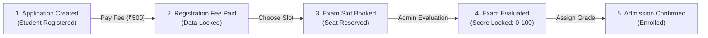

<div align="center">

# 🎓 EduFlow — School Admission & Enrollment Platform

**An enterprise-grade, full-stack school admission management ecosystem designed for modern educational institutions.**

[](https://nextjs.org/)
[](https://reactjs.org/)
[](https://nodejs.org/)
[](https://expressjs.com/)
[](https://www.mongodb.com/)
[](https://razorpay.com/)
[](LICENSE)

<br/>

[Overview](#-overview) •
[Key Features](#-key-features) •
[Admission Lifecycle](#-5-stage-admission-lifecycle) •
[Tech Stack](#-technology-stack) •
[System Architecture](#-system-architecture) •
[Getting Started](#-getting-started) •
[API Reference](#-api-endpoints-reference) •
[Security](#-security--data-integrity)

<br/>

</div>

---

## 📌 Overview

**EduFlow** simplifies and automates the academic admission lifecycle from initial registration to finalized classroom enrollment. Built with a scalable micro-architecture, it delivers two dedicated, role-isolated portals:

1. **Parent & Guardian Portal**: Enables parents to create student applicant profiles, complete secure online registration fee payments via Razorpay with HMAC-SHA256 signature verification, download official digital receipts, and book entrance exam session slots in real-time.
2. **Admission Administration Portal**: Empowers admission officers and school leadership to review applicant directories, manage test center capacity, grade entrance exams (0–100 scale) with one-time tamper-proof locking, and allocate official grade enrollments.

---

## ✨ Key Features

### 👨‍👩‍👧 Parent & Guardian Portal
- **Streamlined Applicant Registration**: Dynamic form validation with age verification rules according to selected grade eligibility.
- **Secure Razorpay Gateway**: Instant ₹500 registration fee processing backed by server-side cryptographic signature validation.
- **Official Digital Receipts**: Auto-generated printable receipts (`REC-2026-XXXX`) containing transaction reference IDs, student details, and verification timestamps.
- **Interactive Exam Slot Booking**: Real-time slot availability indicators (`Available` vs `Full`), session venue details, and single-click reservation.
- **Visual Journey Stepper**: Live 5-stage progress indicator providing clear status visibility at every step of the admission process.

### 🏫 Admission Office & Admin Portal
- **Multi-Session Isolation**: Dual-token authentication system allowing Parent and Admin sessions to run simultaneously across browser tabs without state collision.
- **Comprehensive Candidate Directory**: Search, filter by grade and status, and inspect full applicant dossiers.
- **Session Capacity Management**: Dynamically configure test dates, time windows, room venues, and applicant seat quotas.
- **Tamper-Proof Score Evaluation**: Single-submission test score entry (0–100) with automatic state locking to guarantee grading integrity.
- **Classroom Grade Assignment**: Finalize admissions, allocate students to sections, and issue official admission confirmations.

---

## 🔄 5-Stage Admission Lifecycle

EduFlow enforces a strict state machine to maintain process compliance:



| Stage | Status Code | Parent Capabilities | Admin Capabilities |
| :--- | :--- | :--- | :--- |
| **Stage 1** | `APPLICATION_CREATED` | Edit details, submit fee payment | View application profile |
| **Stage 2** | `REGISTRATION_FEE_PAID` | View & print receipt, book exam slot | View verified transaction log |
| **Stage 3** | `SLOT_BOOKED` | View exam venue, date, and schedule | View candidate attendance roster |
| **Stage 4** | `EXAM_COMPLETED` | View entrance exam score | Enter & permanently lock exam score (0–100) |
| **Stage 5** | `ADMISSION_COMPLETED` | View final enrollment & assigned grade | Allocate classroom and confirm admission |

---

## 🛠️ Technology Stack

| Domain | Technology | Purpose |
| :--- | :--- | :--- |
| **Frontend Framework** | [Next.js 14](https://nextjs.org/) | App Router architecture, Server & Client Components |
| **UI & Styling** | Custom CSS Design System | Responsive grid, teal SaaS tokens, glassmorphism, micro-interactions |
| **Backend Runtime** | [Node.js](https://nodejs.org/) & [Express.js](https://expressjs.com/) | RESTful API server with modular controllers and middlewares |
| **Database** | [MongoDB](https://www.mongodb.com/) & [Mongoose 8](https://mongoosejs.com/) | Schema validations, relational population, and compound indexes |
| **Payment Gateway** | [Razorpay](https://razorpay.com/) | Node SDK & Razorpay Checkout.js with HMAC-SHA256 signature verification |
| **Security & Auth** | JWT, Bcrypt.js, Express-Validator | Password hashing, role-based JWT authentication, defensive input sanitization |

---

## 📁 System Architecture

```text
School_Management/
├── backend/
│   ├── src/
│   │   ├── config/
│   │   │   ├── db.js                 # MongoDB connection & index configuration
│   │   │   └── seed.js               # Database seeder (demo users & exam slots)
│   │   ├── controllers/
│   │   │   ├── authController.js      # User registration & JWT generation
│   │   │   ├── studentController.js   # Student CRUD & Razorpay order creation
│   │   │   ├── examSlotController.js  # Exam sessions & reservation logic
│   │   │   └── admissionController.js # Test evaluation & grade assignment
│   │   ├── middleware/
│   │   │   ├── authMiddleware.js      # Role-based access control (Parent/Admin)
│   │   │   └── errorMiddleware.js     # Centralized error handler & response formatter
│   │   ├── models/
│   │   │   ├── User.js                # User accounts schema (Parent / Admission Team)
│   │   │   ├── Student.js             # Student applicant records & payment details
│   │   │   └── ExamSlot.js            # Exam sessions & capacity tracking
│   │   ├── routes/                    # Express route declarations
│   │   ├── validators/                # Request validation schemas (express-validator)
│   │   ├── app.js                     # Express application configuration
│   │   └── server.js                  # Server entry point
│   ├── .env.example
│   └── package.json
│
├── frontend/
│   ├── app/
│   │   ├── login/                     # Authentication login page
│   │   ├── register/                  # Parent account registration page
│   │   ├── admission/                 # Admin portal (candidates, scores, slots)
│   │   ├── parent/                    # Parent portal (dashboard, payments, slots)
│   │   ├── layout.jsx                 # Root layout & metadata
│   │   └── globals.css                # Global styles & design system tokens
│   ├── components/                    # Reusable UI components (Navbar, Timelines, Badges)
│   ├── context/
│   │   └── AuthContext.jsx            # Multi-session authentication provider
│   ├── lib/
│   │   └── api.js                     # API client & Razorpay checkout integration
│   └── package.json
│
├── .gitignore
└── README.md
```

---

## ⚙️ Environment Variables

### Backend (`backend/.env`)
```env
PORT=5000
NODE_ENV=development
MONGO_URI=mongodb://localhost:27017/school_admission
JWT_SECRET=your_super_secret_jwt_key_2026
JWT_EXPIRES_IN=7d
REGISTRATION_FEE_AMOUNT=500

# Razorpay Payment Gateway Credentials
RAZORPAY_KEY_ID=your_razorpay_key_id
RAZORPAY_KEY_SECRET=your_razorpay_key_secret
```

### Frontend (`frontend/.env.local`)
```env
NEXT_PUBLIC_API_URL=http://localhost:5000/api
NEXT_PUBLIC_RAZORPAY_KEY_ID=your_razorpay_key_id
```

---

## 🚦 Getting Started

### 1. Prerequisites
- **Node.js**: v18.0.0 or higher
- **npm**: v9.0.0 or higher
- **MongoDB**: Local instance running on port `27017` or MongoDB Atlas URI

### 2. Clone the Repository
```bash
git clone https://github.com/RiyaRahees/School_Management.git
cd School_Management
```

### 3. Backend Setup
```bash
# Navigate to backend directory
cd backend

# Install dependencies
npm install

# Setup environment variables
cp .env.example .env

# (Optional) Seed demo users & test slots
npm run seed

# Start development server
npm run dev
```
> The backend server will start on `http://localhost:5000`.

### 4. Frontend Setup
```bash
# In a new terminal, navigate to frontend directory
cd frontend

# Install dependencies
npm install

# Start Next.js development server
npm run dev
```
> Open your browser and navigate to `http://localhost:3000`.

---

## 🔑 Demo Credentials

After running `npm run seed`, you can authenticate using:

| Role | Email | Password | Access Level |
| :--- | :--- | :--- | :--- |
| **Parent / Guardian** | `riya.rahees@example.com` | `password123` | Parent Dashboard & Applications |
| **Admission Officer** | `admin@school.com` | `admin123` | Full Administrative Controls |

---

## 📡 API Endpoints Reference

### 🔐 Authentication (`/api/auth`)
| Method | Endpoint | Access | Description |
| :--- | :--- | :--- | :--- |
| `POST` | `/api/auth/register` | Public | Register a new parent user account |
| `POST` | `/api/auth/login` | Public | Authenticate user & return JWT token |
| `GET` | `/api/auth/me` | Protected | Fetch current user session profile |

### 👨‍🎓 Student Management & Payments (`/api/students`)
| Method | Endpoint | Access | Description |
| :--- | :--- | :--- | :--- |
| `GET` | `/api/students` | Parent | List all students linked to the authenticated parent |
| `POST` | `/api/students` | Parent | Create a new student applicant record |
| `GET` | `/api/students/:id` | Parent/Admin | Retrieve individual student application dossier |
| `PUT` | `/api/students/:id` | Parent | Update student info (only when in `APPLICATION_CREATED`) |
| `POST` | `/api/students/:id/razorpay/create-order` | Parent | Initialize Razorpay payment order for ₹500 fee |
| `POST` | `/api/students/:id/razorpay/verify` | Parent | Verify payment signature & lock application data |

### 📅 Exam Slot Management (`/api/exam-slots`)
| Method | Endpoint | Access | Description |
| :--- | :--- | :--- | :--- |
| `GET` | `/api/exam-slots` | Protected | List all exam sessions with capacity status |
| `POST` | `/api/exam-slots` | Admin | Create a new entrance exam session slot |
| `POST` | `/api/exam-slots/:id/book` | Parent | Reserve a slot for a fee-paid applicant |

### 🏫 Admission Administration (`/api/admission`)
| Method | Endpoint | Access | Description |
| :--- | :--- | :--- | :--- |
| `GET` | `/api/admission/applications` | Admin | Search and filter all student applications |
| `PUT` | `/api/admission/students/:id/score` | Admin | Record test score (0–100, one-time lock) |
| `PUT` | `/api/admission/students/:id/assign` | Admin | Assign grade/section & confirm admission |

---

## 🛡️ Security & Data Integrity

- **Cryptographic Signature Verification**: Every Razorpay payment transaction is validated server-side using SHA-256 HMAC digest verification before state mutation.
- **Session Isolation**: Dual-token storage keys (`admission_admin_token` and `admission_parent_token`) prevent race conditions and cross-role state pollution.
- **Strict Input Validation**: All incoming requests pass through express-validator schemas for type safety and sanitization.
- **Immutable State Progression**: Business rules strictly prevent out-of-sequence actions or retroactive modifications once a stage is completed.

---

## 📄 License

This project is licensed under the [MIT License](LICENSE).

---

<div align="center">
  <sub>Designed & Developed for Modern Educational Institutions.</sub>
</div>
