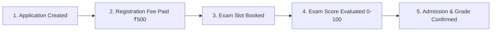

# 🎓 EduFlow — School Admission Management System

EduFlow is a full-stack, enterprise-grade school admission and enrollment platform designed for modern academic institutions. It provides role-isolated portals for **Parents/Guardians** and the **School Admission Team**, featuring automated payment processing via Razorpay, dynamic entrance exam scheduling, score evaluations, and course assignment.

---

## 🚀 Key Features

### 👨‍👩‍👧 1. Parent Portal
- **Student Profile Management**: Register student applicants with real-time age validation, flexible DOB typing (`YYYY-MM-DD` or `DD/MM/YYYY`), and calendar picker.
- **Razorpay Payment Integration**: Direct, seamless registration fee settlement (₹500) with 256-bit SSL encryption, automated payment verification, and webhook-ready handlers.
- **Official Digital Fee Receipts**: Real-time printable & downloadable admission receipts (`window.print()`) with unique transaction references (`REC-2026-XXXX`).
- **Entrance Exam Slot Booking**: Dynamic slot selector card showing session dates, timings, venues, and capacity limits.
- **Visual Admission Journey**: Real-time 5-stage progress timeline tracking from application creation to final admission.

### 🏫 2. Admission Office & Administrative Portal
- **Role-Isolated Multi-Session**: Parent and Admin sessions run concurrently across tabs without token collisions.
- **Application Directory**: Search, filter, and inspect applicant profiles across grades and status pipelines.
- **Exam Slot Management**: Create, view, and assign test slots with real-time seat availability tracking.
- **Exam Score Evaluation**: Record entrance test marks (0–100 scale) with **one-time lock protection** to prevent unauthorized post-submission edits.
- **Course & Grade Assignment**: Finalize student enrollment and assign admitted grades upon successful evaluation.

---

## 🔄 5-Stage Admission Workflow



1. **`APPLICATION_CREATED`**: Parent registers student information. Student details remain editable only in this stage.
2. **`REGISTRATION_FEE_PAID`**: Parent completes ₹500 registration fee via Razorpay. Student data is locked for verification.
3. **`SLOT_BOOKED`**: Parent books a preferred entrance exam slot.
4. **`EXAM_COMPLETED`**: Admission team enters entrance test marks. Score is permanently recorded and locked.
5. **`ADMISSION_COMPLETED`**: Admission team assigns final grade. Admission is confirmed.

---

## 🛠️ Technology Stack

| Layer | Technology |
| :--- | :--- |
| **Frontend Framework** | [Next.js 14](https://nextjs.org/) (App Router, React 18) |
| **Styling & Design System** | Modern Vanilla CSS (SaaS Design Tokens, Glassmorphism, Responsive Grid) |
| **Backend Runtime** | [Node.js](https://nodejs.org/) & [Express.js 4](https://expressjs.com/) |
| **Database** | [MongoDB](https://www.mongodb.com/) via [Mongoose 8](https://mongoosejs.com/) |
| **Payment Gateway** | [Razorpay](https://razorpay.com/) (Node SDK & Razorpay Checkout.js) |
| **Authentication & Security** | JWT (JSON Web Tokens), `bcryptjs`, `helmet`, `cors`, `express-validator` |

---

## 📁 Project Structure

```text
School_mangement/
├── backend/
│   ├── src/
│   │   ├── config/
│   │   │   ├── db.js                # MongoDB Connection
│   │   │   └── seed.js              # Database Seeder (Demo Users & Slots)
│   │   ├── controllers/
│   │   │   ├── authController.js     # User Registration & Auth
│   │   │   ├── studentController.js  # Student Lifecycle & Razorpay Orders
│   │   │   ├── examSlotController.js # Exam Slot Management & Booking
│   │   │   └── admissionController.js# Score Evaluation & Course Allocation
│   │   ├── middleware/
│   │   │   └── authMiddleware.js     # JWT & Role-Based Access Control
│   │   ├── models/
│   │   │   ├── User.js               # Parent & Admin Schemas
│   │   │   ├── Student.js            # Applicant Records & Payment History
│   │   │   └── ExamSlot.js           # Scheduled Exam Sessions & Capacity
│   │   ├── routes/                   # Express API Endpoints
│   │   ├── validators/               # Input Validation & Sanitization
│   │   ├── app.js                    # Express App Configuration
│   │   └── server.js                 # HTTP Server Entry Point
│   ├── .env                          # Backend Environment Config
│   └── package.json
│
├── frontend/
│   ├── app/
│   │   ├── (auth)/login, register    # Authentication Views
│   │   ├── admission/                # Admin Portal (Score Entry, Course Assign)
│   │   ├── parent/                   # Parent Portal (Dashboard, Payments, Slots)
│   │   ├── layout.jsx                # Global App Shell & Navigation
│   │   └── globals.css               # Design System & Token Styles
│   ├── components/                   # Reusable Components (Timeline, Forms, Icons)
│   ├── context/
│   │   └── AuthContext.jsx           # Multi-Session Auth Provider
│   ├── lib/
│   │   └── api.js                    # API Client & Razorpay Checkout Helper
│   ├── .env.local                    # Frontend Environment Config
│   └── package.json
└── README.md
```

---

## ⚙️ Environment Variables

### Backend Configuration (`backend/.env`)
```env
PORT=5000
NODE_ENV=development
MONGO_URI=mongodb://localhost:27017/school_admission
JWT_SECRET=your_super_secret_jwt_key_2026
JWT_EXPIRE=7d
REGISTRATION_FEE_AMOUNT=500

# Razorpay Payment Gateway Credentials
RAZORPAY_KEY_ID=your_razorpay_key_id
RAZORPAY_KEY_SECRET=your_razorpay_key_secret
```

### Frontend Configuration (`frontend/.env.local`)
```env
NEXT_PUBLIC_API_URL=http://localhost:5000/api
NEXT_PUBLIC_RAZORPAY_KEY_ID=your_razorpay_key_id
```

---

## 🚦 Getting Started

### 1. Prerequisites
- [Node.js](https://nodejs.org/) (v18 or higher recommended)
- [MongoDB](https://www.mongodb.com/) running locally on `localhost:27017` or a MongoDB Atlas URI

---

### 2. Backend Setup
```bash
# Navigate to backend directory
cd backend

# Install dependencies
npm install

# (Optional) Seed demo users, candidates, and exam slots
npm run seed

# Start development server (Port 5000)
npm run dev
```

---

### 3. Frontend Setup
```bash
# Navigate to frontend directory
cd frontend

# Install dependencies
npm install

# Start Next.js development server (Port 3000)
npm run dev
```

Open your browser and navigate to: **`http://localhost:3000`**

---

## 🔑 Default Demo Accounts

If you execute `npm run seed` in the backend, you can log in with the following pre-configured credentials:

| Role | Portal URL | Email | Password |
| :--- | :--- | :--- | :--- |
| **Parent / Guardian** | `http://localhost:3000/login` | `riya.rahees@example.com` | `password123` |
| **Admission Team** | `http://localhost:3000/login` | `admin@school.com` | `admin123` |

---

## 📡 API Endpoints Overview

### Authentication (`/api/auth`)
- `POST /api/auth/register` — Create a new Parent account.
- `POST /api/auth/login` — Login and receive JWT token.
- `GET /api/auth/me` — Fetch current user profile.

### Student Management & Payments (`/api/students`)
- `GET /api/students` — Retrieve parent's student applicants.
- `POST /api/students` — Register a new student profile.
- `GET /api/students/:id` — Get detailed application status.
- `PUT /api/students/:id` — Update student details (while in `APPLICATION_CREATED`).
- `POST /api/students/:id/razorpay/create-order` — Create Razorpay order (₹500).
- `POST /api/students/:id/razorpay/verify` — Verify cryptographic signature & settle fee.

### Exam Slots (`/api/exam-slots`)
- `GET /api/exam-slots` — List available exam dates and remaining seat capacity.
- `POST /api/exam-slots/:id/book` — Reserve an exam slot for a student.

### Admission Management (`/api/admission`)
- `GET /api/admission/applications` — List all student candidates across school pipeline.
- `PUT /api/admission/students/:id/score` — Record entrance test marks (0–100).
- `PUT /api/admission/students/:id/assign` — Confirm admission & assign final class/grade.

---

## 🔒 Security Best Practices
- **Password Hashing**: Strong bcrypt salt rounds on all user passwords.
- **Signature Verification**: Razorpay SHA256 HMAC verification prevents client-side tampering.
- **Session Isolation**: Separate storage keys for parent and administrative tokens preventing concurrent session overlap.
- **Sanitized Headers**: Express security hardened with `helmet` and strict CORS origins.

---

## 📄 License
This project is licensed under the MIT License.
